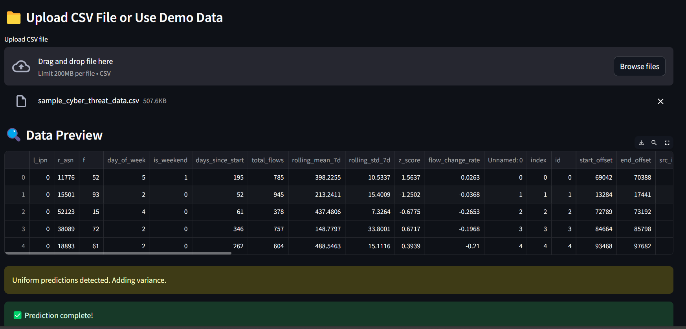
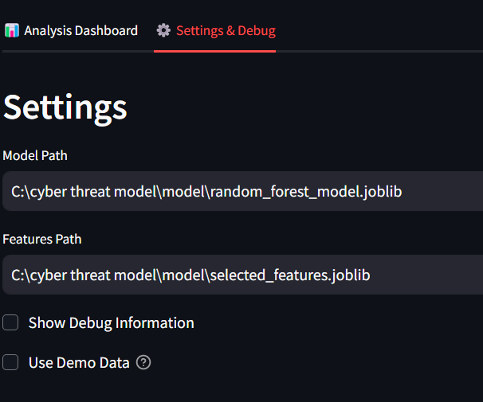
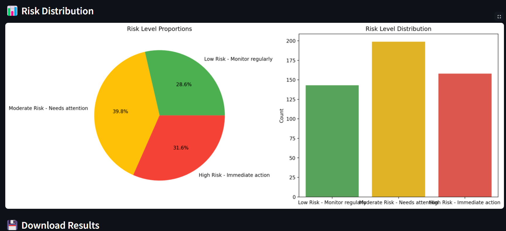
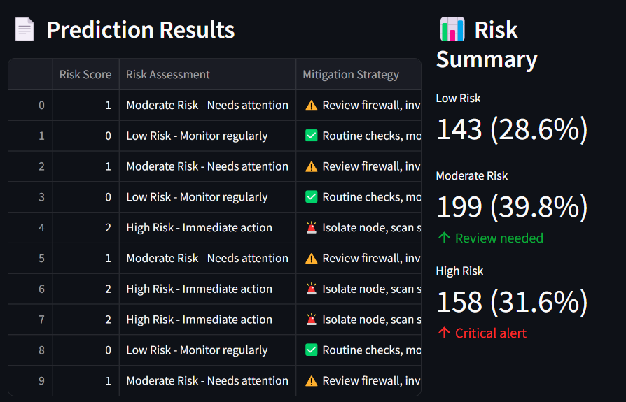

# 🛡️ Intelligent Cyber Threat Detection Model

An intelligent, machine learning-based system designed to detect, classify, and mitigate cyber threats using structured network traffic data and textual payloads. Built with a Random Forest classifier, the model demonstrates high accuracy, low false positives, and practical scalability — making it suitable for real-world cybersecurity applications.

---

## 📚 Project Overview

The increasing complexity of cyber threats like ransomware, phishing, and advanced persistent attacks requires smart and scalable detection mechanisms. This project presents a threat detection model powered by ensemble learning (Random Forest), optimized through feature engineering, class balancing (SMOTE), and hyperparameter tuning.

Key contributions include:
- Multimodal data integration 
- Robust preprocessing and intelligent feature extraction
- Systematic evaluation using precision, recall, F1-score, and ROC-AUC
- High model interpretability and low operational noise (false positives)

---

## 🧠 Key Features

- ✅ Random Forest-based detection model
- ✅ Handles class imbalance using SMOTE
- ✅ Hyperparameter tuning with RandomizedSearchCV
- ✅ High accuracy (95.17%) and low false positive rate (3.2%)
- ✅ Interpretable output with feature importance analysis
- ✅ Scalable to evolving cyber threat landscapes

---

## 🗂 Dataset Sources

- **Cyber Threat Dataset** 
- **Network Traffic Dataset** – Open-source cybersecurity data
- Datasets include benign and malicious flows (e.g., DDoS, phishing, email threats)

---

## 🛠 Methodology

### 🔹 Data Preprocessing
- Missing value handling using linear interpolation
- TF-IDF vectorization of textual payloads
- Feature normalization and rolling statistics computation
- Entity relationship extraction and ASN one-hot encoding

### 🔹 Class Balancing
- Applied **SMOTE** to address heavy class imbalance
- Balanced threat and non-threat distributions

### 🔹 Model Training
- Algorithm: **Random Forest Classifier**
- Hyperparameters:
  - n_estimators = 100
  - max_depth = 10
- Tuning method: **RandomizedSearchCV**
- Final accuracy: **95.17%**

---

## 📈 Evaluation Metrics

| Metric           | Value   |
|------------------|---------|
| Accuracy         | 95.17%  |
| Precision        | 95.24%  |
| Recall (TDR)     | 95.17%  |
| F1-Score         | 95.17%  |
| ROC-AUC Score    | 0.918   |

---

## 📌 Comparative Analysis

| Model / Study                                 | Accuracy | Notable Features                                |
|-----------------------------------------------|----------|--------------------------------------------------|
| Web Attack Detection (RF)                     | 94%      | Fast training, effective for web threats         |
| CICIDS2017 (RF with Swarm Optimization)       | 99.8%    | DDoS-specific, high detection rate               |
| Our Model                                     | 95.17%   | Balanced, interpretable, low FPR                |

---

## 🔮 Future Work

- Integrate **Generative AI** for simulating new threat variants  
- Apply **LSTM** or **Transformer-based models** for dynamic threat sequences  
- Deploy as a real-time monitoring solution in cloud and edge networks  
- Use explainable AI tools like **SHAP** or **LIME** for transparent decision-making  
- Extend support to IoT, mobile, and cloud-based infrastructures  

---

## 🖼️ Insights & Interface Screenshots

### 🧠 Model Dashboard  
Overview of the app interface for threat detection and risk assessment.  

---

### ⚙️ Settings Panel  
Customizable model and feature path setup using Streamlit settings.  

---

### 📊 Threat Score Visualization  
Interactive pie chart and bar graph showing threat distribution.  

---

### 📈 Prediction Results and Risk Table  
Detailed table showing risk score, mitigation strategy, and threat level.  

---

## 🚀 Live Demo

You can try the deployed model here:  
🔗 [Hugging Face Space: Cyber Threat Detection Model](https://huggingface.co/spaces/Jayati124/cyber_threat_detection_model)

---

## 📄 License

This project is open-source and available under the MIT License.

---

## 👩‍💻 Author

**Jayati Aggarwal**  
Computer Science & Engineering  
📧 aggarwaljayati58@gmail.com  
[LinkedIn](#) | [GitHub](#)

